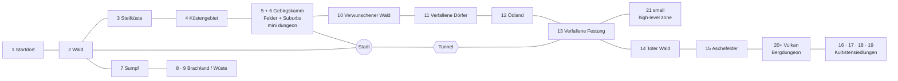

# Content — World & Zone Progression

The zone map skeleton: progression order, scope tiers, connections, and
locations not yet owned by a zone doc. Conventions → `README.md` → Content.
Per-zone design intent lives in `content-zone<N>.md`; runtime placement truth
is the zone JSON authored via the editor (`manual-zone-editor.md`).

## Zone progression

- **21+ zones.** A zone's **number = its position on the progression
  curve**, **not** an absolute character level (ties to the power curve,
  GDD §5: mobs are authored per zone tier).
- **Scope tiers:**
  - **Prototype** = Zone 1 + Zone 2
  - **Early build** = Zones 1–6 + the City
  - **Full release** = everything up to the volcano / dragons (20+)

> **Provenance.** The list and graph below were transcribed 2026-08-10 from a
> PO photo of the hand-drawn zone proposal. It supersedes the 2026-07-09
> `zones.png` capture, which was never transcribed and is **no longer in the
> repo**: the skeleton above is all that survived of it. Do not let this one
> go the same way. The zone names are kept in the authored German with an
> English gloss.

## The zone list

| # | Zone (as authored) | Gloss | Inhabitants |
|---|---|---|---|
| 1 | Startdorf mit Wald + Feldern | Starting village, forest and fields | Tiere |
| 2 | Wald + Holzfäller | Forest and a logging camp | Tiere + Kobolde / small fantasy creatures |
| 3 | Steilküste | Cliff coast | Tiere + Banditen |
| 4 | Küstengebiet + Fischer | Coastal region, fishing folk | Tiere + Banditen |
| 5 + 6 | Gebirgskamm · Felder + Suburbs | Mountain ridge (carries a **mini dungeon**), fields and suburbs. **One big zone**, not two. | Tiere + Banditen · Tiere + Söldner |
| — | **Stadt** | **The City**, the hub | *(hub, see below)* |
| 7 | Sumpf | Swamp | Fantasy-Tiere |
| 8 / 9 | Brachland / Wüste | Wasteland and desert | Wüstenfantasy |
| 10 | Verwunschener Wald | Enchanted forest | Fantasy-Tiere |
| 11 | Verfallene Dörfer | Ruined villages | Söldner |
| 12 | Ödland + Gebirgsausläufer | Badlands and mountain foothills | Söldner + Fantasy |
| 13 | Verfallene Festung | Ruined fortress | Untote + Fantasy |
| 14 | Toter Verwunschener Wald | Dead enchanted forest | Untote + corrupted Fantasy-Tiere |
| 15 | Aschefelder | Ash fields | Untote + Elementare |
| 16 / 17 / 18 / 19 | Aschefelder + Kultistensiedlungen | Ash fields and cultist settlements | Untote, Kultisten, Elementare, Drachlinge |
| 20+ | Vulkan + Bergdungeon | Volcano and mountain dungeon | Alles + Drachen |
| 21 | *(unnamed on the sketch)* | A **small high-level zone** hanging off 13, past the fortress. | *(unassigned)* |

**Zones 3, 4 and 5 share one inhabitant entry** in the source (ditto marks
under zone 3), so the coast run is one continuous Tiere + Banditen band.

**5 and 6 are a single large zone** (PO 2026-08-10), which is why the sketch
draws them in one oval. It touches the coast run at 4, the enchanted forest at
10, and the City directly, so it is the loop's northern shoulder rather than a
stop on it.

**Faction status against what is built:** Banditen, Kobolde and Elementare are
shipped content (`api/factions/`, `api/mobs/`). **Söldner, Untote, Kultisten,
Drachlinge and Drachen have no mob, no faction and no design stub anywhere in
the repo**, which is everything from roughly zone 11 upward.

## The connectivity graph

Not a corridor: a northern **loop** returning to the City through the tunnel,
with a southern dead-end arm (the swamp and desert) and a late-game tail.

Consequences the flat list does not show: the **City has three entrances**
(zone 2, the 5+6 zone, and much later zone 13 through the tunnel), and because
8/9, 21 and 16–19 sit in parallel or hang off the side rather than in
sequence, the **effective linear depth is well under 21 steps**. Any
levels-per-zone arithmetic off that is [PLACEHOLDER] thinking, not a decision.

**Dead ends** (PO 2026-08-10): the desert arm **8/9 does not reconnect**, and
**21** is a small high-level pocket off 13. Both are optional side content,
not progression gates.

⚠ **One unconfirmed edge, needs a PO pass:** where the separate "20+ Berg
Dungeon" box below the City attaches. It may be the same place as the 20+
volcano node or a second mountain dungeon reached from the City side.

## Connections and playfield

**Connections:** the **tunnel Zone 1 ↔ Zone 2** is the first dark area — the
natural light-role tutorial (GDD §7; detail in `content-zone1.md`). The sketch
adds a **second, much later tunnel**, City ↔ zone 13, which closes the loop.

**The playfield (since step 6 C1):** zones 1+2 ship as ONE zone file,
`api/zones/world.json` (144×72; west half = Z1, east half = Z2 — design
labels, not engine objects). It is the boot default (`game.zone: "world"`);
the proving grounds stay reachable via `-zone proving-grounds`.

⚑ **Nothing in the engine supports this map yet, and that is fine at
Prototype tier.** One zone file loads per boot into one `phy.Space`; there is
no transition code, and multi-Space sharding is deferred
(`archive/plan-world-zones.md` §1.2 calls a Space boundary "a hard simulation
wall"). The measured area ceiling is ~18× today's map at constant density
(`project_scaling_profile`), the client webpack-bundles **every** zone JSON
eagerly (`GroundTextureManager`), and zone chat is decided but unbuilt.

## Unplaced locations (no zone yet)

| Place | Note |
|---|---|
| Caves in general | Dark, Pokémon-cave style; open-world dungeons, no instances. |
| "Way of the Warrior" sign | Clue location → short dungeon with a DPS-aura reward. |
| Troll territory | A clue NPC leads there; reward = the Heal cooldown unlock. |
| A dark forest with the dog NPC *(2026-07-16)* | Self-contained teaching beat (→ `content-npcs.md`). Could be zone 1's forest or a later, darker one. |
| Prison camp / mining colony | Gothic 1 vibe (2026-07-09 seed); later zone. |
