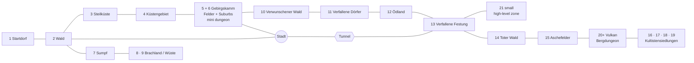

# Content — World & Zone Progression

The zone map skeleton: progression order, scope tiers, connections, and
locations not yet owned by a zone doc. Conventions → `README.md` → Content.
Zone 1 + Zone 2 design intent lives in
[`content-zone-design-guide.md`](content-zone-design-guide.md) (the old
`content-zone1.md` / `content-zone2.md` are archived: they describe the
144×72 world). Runtime placement truth is the zone JSON authored in Tiled
(`manual-tiled-editor.md`): `api/zones/world.json`, read it with
`node scripts/zone-census.mjs`.

⭐ **This doc owns the zone list, its order, and which region of `world.json`
is which zone.** The level design guide and the map both follow it.

## Zone progression

- **21+ zones.** A zone's **number = its position on the progression
  curve**, **not** an absolute character level (ties to the power curve,
  GDD §5: mobs are authored per zone tier).
- **Scope tiers:**
  - **Prototype** = Zone 1 + Zone 2
  - **Early build** = Zones 1–6 + the City
  - **Full release** = everything up to the volcano / dragons (20+)

> **Provenance.** The list and graph below were transcribed 2026-08-10 from a
> PO photo of the hand-drawn zone proposal. It supersedes the 2026-07-09
> `zones.png` capture, which was never transcribed and is **no longer in the
> repo**: the skeleton above is all that survived of it. Do not let this one
> go the same way. The zone names are kept in the authored German with an
> English gloss.

## The zone list

| # | Zone (as authored) | Gloss | Inhabitants |
|---|---|---|---|
| 1 | Startdorf mit Wald + Feldern | Starting village, forest and fields | Tiere |
| 2 | Wald + Holzfäller | Forest and a logging camp | Tiere + Kobolde / small fantasy creatures |
| 3 | Steilküste | Cliff coast | Tiere + Banditen |
| 4 | Küstengebiet + Fischer | Coastal region, fishing folk | Tiere + Banditen |
| 5 + 6 | Gebirgskamm · Felder + Suburbs | Mountain ridge (carries a **mini dungeon**), fields and suburbs. **One big zone**, not two. | Tiere + Banditen · Tiere + Söldner |
| — | **Stadt** | **The City**, the hub | *(hub, see below)* |
| 7 | Sumpf | Swamp | Fantasy-Tiere |
| 8 / 9 | Brachland / Wüste | Wasteland and desert | Wüstenfantasy |
| 10 | Verwunschener Wald | Enchanted forest | Fantasy-Tiere |
| 11 | Verfallene Dörfer | Ruined villages | Söldner |
| 12 | Ödland + Gebirgsausläufer | Badlands and mountain foothills | Söldner + Fantasy |
| 13 | Verfallene Festung | Ruined fortress | Untote + Fantasy |
| 14 | Toter Verwunschener Wald | Dead enchanted forest | Untote + corrupted Fantasy-Tiere |
| 15 | Aschefelder | Ash fields | Untote + Elementare |
| 16 / 17 / 18 / 19 | Aschefelder + Kultistensiedlungen | Ash fields and cultist settlements | Untote, Kultisten, Elementare, Drachlinge |
| 20+ | Vulkan + Bergdungeon | Volcano and mountain dungeon | Alles + Drachen |
| 21 | *(unnamed on the sketch)* | A **small high-level zone** hanging off 13, past the fortress. | *(unassigned)* |

**Zones 3, 4 and 5 share one inhabitant entry** in the source (ditto marks
under zone 3), so the coast run is one continuous Tiere + Banditen band.

**5 and 6 are a single large zone** (PO 2026-08-10), which is why the sketch
draws them in one oval. It touches the coast run at 4, the enchanted forest at
10, and the City directly, so it is the loop's northern shoulder rather than a
stop on it.

**Faction status against what is built:** every inhabitant group on the list
now has shipped mobs and a faction (`api/factions/`, `api/mobs/`). Banditen,
Kobolde and Elementare came first; Söldner (`mercenary`), Untote (`undead`),
Kultisten (`cult`), Drachlinge + Drachen (`dragonkin`) and the fey creatures
landed 2026-09-28 (`8bc9210c`, 18 mobs up to the level-30 Dragon) and are
placed across the rebuilt world. ⚑ They have no design entries yet:
`content-mobs.md` does not describe them.

## The connectivity graph

Not a corridor: a northern **loop** returning to the City through the tunnel,
with a southern dead-end arm (the swamp and desert) and a late-game tail.

```mermaid
graph LR
  Z1[1 Startdorf] --- Z2[2 Wald]
  Z2 --- Z3[3 Steilküste]
  Z3 --- Z4[4 Küstengebiet]
  Z4 --- Z56[5 + 6 Gebirgskamm<br/>Felder + Suburbs<br/>mini dungeon]
  Z56 --- Z10[10 Verwunschener Wald]
  Z10 --- Z11[11 Verfallene Dörfer]
  Z11 --- Z12[12 Ödland]
  Z12 --- Z13[13 Verfallene Festung]
  Z2 --- CITY((Stadt))
  Z56 --- CITY
  CITY --- TUN{{Tunnel}}
  TUN --- Z13
  Z13 --- Z21[21 small<br/>high-level zone]
  Z13 --- Z14[14 Toter Wald]
  Z14 --- Z15[15 Aschefelder]
  Z15 --- END[20+ Vulkan<br/>Bergdungeon]
  END --- Z16[16 · 17 · 18 · 19<br/>Kultistensiedlungen]
  Z2 --- Z7[7 Sumpf]
  Z7 --- Z89[8 · 9 Brachland / Wüste]
```

Consequences the flat list does not show: the **City has three entrances**
(zone 2, the 5+6 zone, and much later zone 13 through the tunnel), and because
8/9, 21 and 16–19 sit in parallel or hang off the side rather than in
sequence, the **effective linear depth is well under 21 steps**. Any
levels-per-zone arithmetic off that is [PLACEHOLDER] thinking, not a decision.

**Dead ends** (PO 2026-08-10): the desert arm **8/9 does not reconnect**, and
**21** is a small high-level pocket off 13. Both are optional side content,
not progression gates.

⚠ **One unconfirmed edge, needs a PO pass:** where the separate "20+ Berg
Dungeon" box below the City attaches. It may be the same place as the 20+
volcano node or a second mountain dungeon reached from the City side.

## Connections and playfield

**Connections:** the **dark tunnel** is the first dark area and the natural
light-role tutorial (GDD §7). The level design guide puts it in Zone 2 as the
alternate route into the City
([`content-zone-design-guide.md`](content-zone-design-guide.md) §3.2); ⚑ the
live `tunnel.json` is not that yet (guide §0.3). The sketch adds a **second,
much later tunnel**, City ↔ zone 13, which closes the loop.

**The playfield (since 2026-09-24):** the PO rebuilt `api/zones/world.json`
from scratch as ONE 540×360 map, laid out in the order of the list above; it
is the release map (`plan-release-map.md` §9). Zones are **titled regions**
inside it (`regions[].title` / `subtitle`, announced by a banner on entry), not
files: the D6 model, `plan-release-map.md` §8. It is the boot START ZONE
(`game.startZone: "world"`). Interiors are separate files placed far away in
the same coordinate space and entered through a door: `barn.json`,
`tunnel.json`, `underworld.json` (`plan-underworld.md`). The old 144×72 world
(zones 1+2 as west and east halves) loads only under `-debug-zones`
(`api/zones/.debug/world_debug.json`).

**Region ↔ zone, confirmed (PO 2026-09-30):**

| Zone | Region(s) in `world.json` |
|---|---|
| 1 Startdorf mit Wald + Feldern | Farmlands · Brackenfold Meadows · Saltgrass Strand |
| 2 Wald + Holzfäller | Deep Woods |
| Stadt | Brunnstedt |

⚑ **The other regions are NOT yet mapped to zone numbers here.** The world
was placed "in the order of content-world.md" (`8bc9210c`), but a table
inferred from region names would be a guess, and some regions (Southgate
Sprawl, Northgate Commons, The Umberwood, Moonveil Grove) have no obvious row.
PO to confirm before anything relies on it. `node scripts/zone-census.mjs`
lists every region with its current level range.

## Unplaced locations (no zone yet)

| Place | Note |
|---|---|
| Caves in general | Dark, Pokémon-cave style; open-world dungeons, no instances. |
| "Way of the Warrior" sign | Clue location → short dungeon with a DPS-aura reward. |
| Troll territory | A clue NPC leads there; reward = the Heal cooldown unlock. |
| A dark forest with the dog NPC *(2026-07-16)* | Self-contained teaching beat (→ `content-npcs.md`). Could be zone 1's forest or a later, darker one. |
| Prison camp / mining colony | Gothic 1 vibe (2026-07-09 seed); later zone. |
